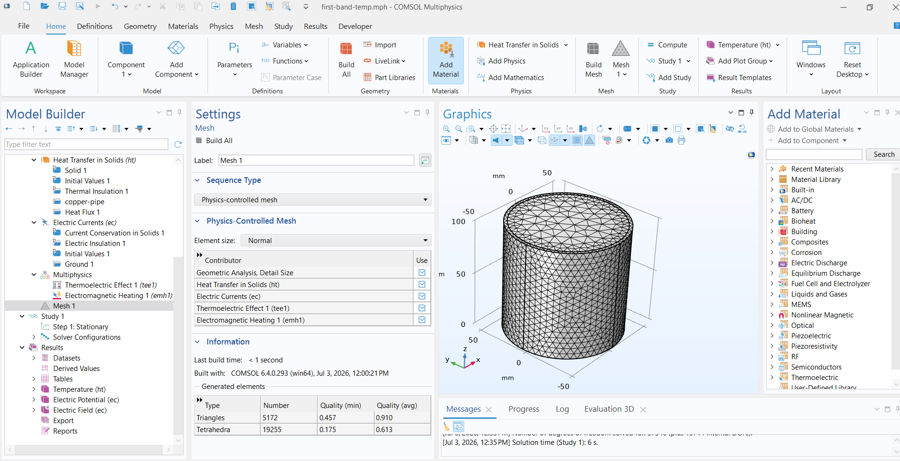
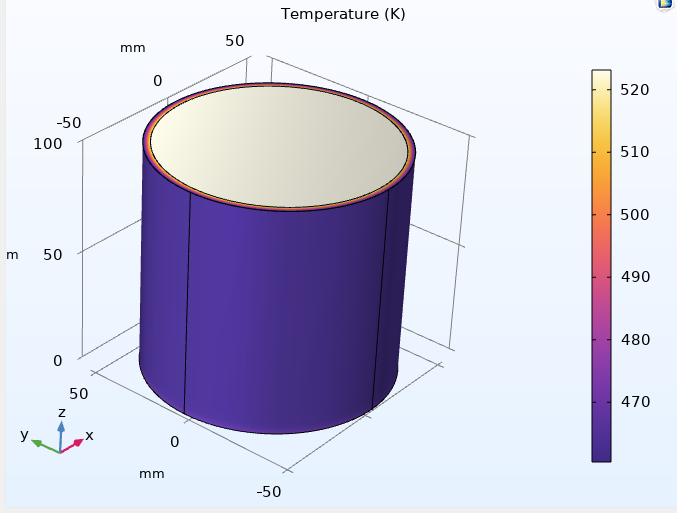
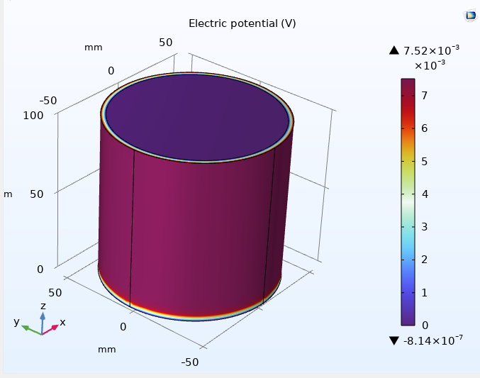

# Auri Labs: 3D FEA Thermoelectric Composite Model (V1)

## English

### Abstract
This folder contains the Version 1 (V1) 3D Finite Element Analysis (FEA) simulations developed for the Auri-FlexTEG project using COMSOL Multiphysics. The objective is to evaluate the radial heat transfer and thermoelectric potential of a flexible Ag2Se/PEDOT:PSS composite band wrapped around an industrial waste-heat pipe. This initial stationary study analyzes a monolithic composite shell to validate the baseline multiphysics coupling (Heat Transfer + Electric Currents).

### Methodology & Parameters
The simulation employs a 3D cylindrical geometry to mimic real-world pipe integration. 
* **Core Pipe (Heat Source):** Copper cylinder, $r = 50 \text{ mm}$, assigned an internal boundary temperature of 250 °C.
* **TEG Band (Composite):** 3 mm thick outer shell ($r = 53 \text{ mm}$). 
* **Material Properties (Auri-Band):** Based on analytical percolation limits, the composite is defined with a thermal conductivity ($k$) of 0.4 W/(m·K), electrical conductivity ($\sigma$) of 8810 S/m, and a Seebeck coefficient ($S$) of 120 µV/K.
* **Cooling Mechanism:** A convective heat flux ($h = 50 \text{ W/(m}^2\text{·K)}$) is applied to the outer boundary, simulating a moderate industrial draft at 25 °C ambient temperature.

### Results & Discussion
1. **Thermal Gradient:** The model successfully demonstrates radial heat dissipation. The internal temperature of 523 K drops to approximately 465 K at the outer boundary, establishing a $\Delta T$ of 58 K across the 3 mm composite. 
2. **Thermoelectric Potential:** The coupled physics solver yields a peak electric potential of **~7.5 mV** across the single-domain shell. 

**Note on Voltage Scaling:** The 7.5 mV output represents the potential of a *single continuous unit*. In industrial manufacturing, this monolithic band will be replaced by a segmented architecture featuring thousands of alternating n-type and p-type micro-blocks connected electrically in series. The total theoretical voltage is defined as:
$$V_{total} = N \cdot V_{cell}$$
Where $N$ is the number of series-connected cell pairs. Therefore, a segmented roll-to-roll band will easily scale this baseline potential into the multi-volt range suitable for industrial IoT sensors.

---

## Türkçe

### Özet
Bu klasör, Auri-FlexTEG projesi için COMSOL Multiphysics kullanılarak geliştirilen Versiyon 1 (V1) 3 Boyutlu Sonlu Elemanlar Analizi (FEA) simülasyonlarını içermektedir. Temel amaç, endüstriyel bir atık ısı borusunun etrafına sarılmış esnek Ag2Se/PEDOT:PSS kompozit bandının radyal ısı transferini ve termoelektrik potansiyelini değerlendirmektir. Bu ilk durağan (stationary) çalışma, çoklu-fizik (Isı Transferi + Elektrik Akımları) bağlantısını doğrulamak için tek parça (monolitik) bir kompozit kabuğu analiz etmektedir.

### Metodoloji ve Parametreler
Gerçek dünya entegrasyonunu taklit etmek için 3 boyutlu silindirik bir geometri kullanılmıştır.
* **İç Boru (Isı Kaynağı):** Bakır silindir, $r = 50 \text{ mm}$, iç yüzey sıcaklığı 250 °C (523 K) olarak atanmıştır.
* **TEG Bandı (Kompozit):** 3 mm kalınlığında dış kabuk ($r = 53 \text{ mm}$).
* **Malzeme Özellikleri (Auri-Band):** Analitik sızma eşiği (percolation) sınırlarına dayanarak, kompozitin termal iletkenliği ($k$) 0.4 W/(m·K), elektriksel iletkenliği ($\sigma$) 8810 S/m ve Seebeck katsayısı ($S$) 120 µV/K olarak tanımlanmıştır.
* **Soğutma Mekanizması:** Dış yüzeye, 25 °C ortam sıcaklığında orta seviyeli bir endüstriyel hava akımını simüle eden konvektif bir ısı akısı ($h = 50 \text{ W/(m}^2\text{·K)}$) uygulanmıştır.

### Sonuçlar ve Değerlendirme
1. **Termal Gradyan:** Model, radyal ısı dağılımını başarıyla göstermektedir. 523 K'lik iç sıcaklık, dış sınırda yaklaşık 465 K'ye düşerek 3 mm'lik kompozit boyunca 58 K'lik bir $\Delta T$ (sıcaklık farkı) oluşturmaktadır.
2. **Termoelektrik Potansiyel:** Çoklu-fizik çözücü, tek etki alanlı kabuk boyunca yaklaşık **7.5 mV**'luk bir tepe elektrik potansiyeli üretmiştir.

**Voltaj Ölçeklendirmesi Üzerine Not:** Elde edilen 7.5 mV'luk çıkış, *tek bir sürekli birimin* potansiyelini temsil etmektedir. Endüstriyel üretim aşamasında, bu monolitik bant, elektriksel olarak seri bağlanmış binlerce ardışık n-tipi ve p-tipi mikro-bloktan oluşan segmentli (zebra) bir mimari ile değiştirilecektir. Toplam teorik voltaj şu şekilde tanımlanır:
$$V_{total} = N \cdot V_{cell}$$
Burada $N$, seri bağlı hücre çiftlerinin sayısını ifade eder. Bu nedenle, segmentli üretilecek bir rulo bant, bu temel potansiyeli endüstriyel IoT sensörleri için uygun olan Volt seviyelerine kolayca taşıyacaktır.

***
*(Images below: Mesh generation, Thermal Gradient distribution, and resulting Electric Potential)*

