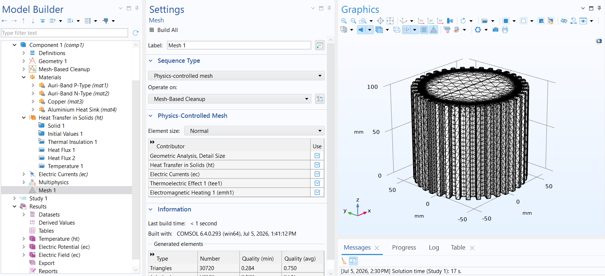
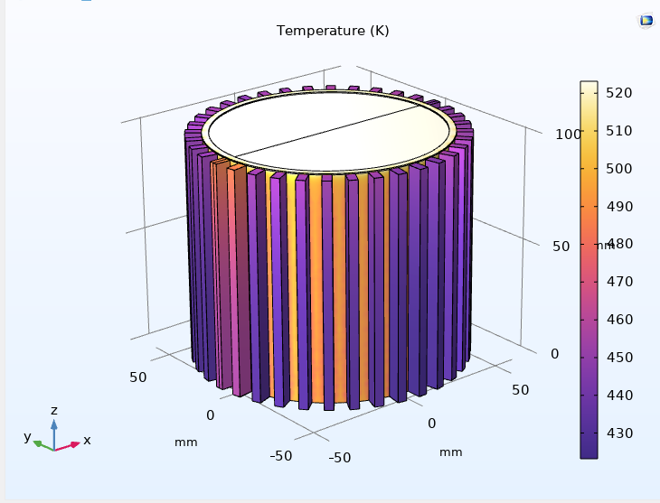
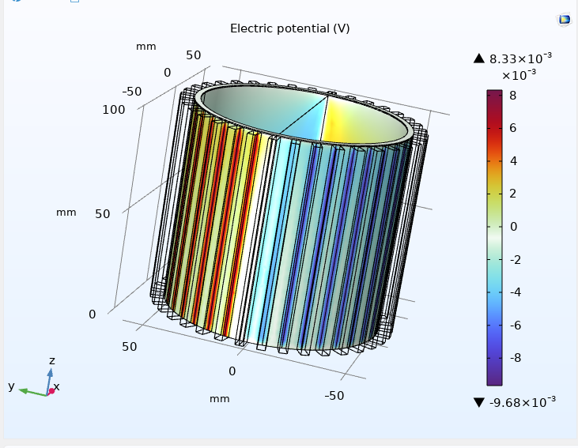

# Auri Labs: V3 - Hybrid Architecture & Multi-Physics Debugging
## Realistic 3D FEA Thermoelectric Optimization

## English

### 1. Abstract
This folder contains the Version 3 (V3) iteration of the Auri-FlexTEG project. Moving away from the monolithic (and theoretically flawed) V2 geometry, V3 introduces a true **Hybrid Architecture**. In this model, electrical generation is strictly isolated to the 3mm inner composite band ($Ag_2Se$ / PEDOT:PSS), exploiting the intrinsic flexibility and high room-temperature efficiency of Silver Selenide. Meanwhile, the outer fins act purely as passive aluminum heat sinks. This iteration validates our design for industrial scalability, yielding a highly realistic electrical output while uncovering and solving critical multi-physics divergence issues.

### 2. Multi-Physics Crises & Crisis Management
In R&D, failure is the highest form of data. During the transition to the V3 hybrid model, two major computational and physical crises occurred, both of which were successfully resolved by the Auri Labs engineering team:

#### 🔴 Crisis 1: The 10-Minute CPU Divergence (Matrix Solver Failure)
* **The Problem:** In an attempt to make the aluminum fins electrically insulating, their electrical conductivity was set to `1e-12 S/m`, while the active TE band remained at `8810 S/m`. This created a differential gap of over $10^{15}$ within the iterative matrix solver. The COMSOL solver fell into a divergence loop, maxing out CPU utilization and crashing after 10 minutes. *(See: `images/fail_1_divergence.png`)*
* **The Solution:** Instead of forcing the solver to calculate near-zero currents in a massive domain, the fins were completely removed from the `Electric Currents (ec)` domain selection. By explicitly telling the physics engine to ignore the fins for electricity, the computation time dropped from 10 minutes to mere seconds.

#### 🔴 Crisis 2: Boundary Condition Amnesia (Heat Flux Failure)
* **The Problem:** After using a boolean `Difference` operation (laser cutting) to detach the fins from the inner band, COMSOL reassigned all geometric boundary IDs. Consequently, the atmospheric convective cooling (`Heat Flux 1` and `2`) lost its target surfaces. The simulation ran, but the fins failed to cool, while the internal cut-faces artificially radiated heat. *(See: `images/fail_2_heatflux.png`)*
* **The Solution:** A full boundary mapping audit was conducted. The outer flat faces of the fins were manually reassigned to high-velocity convection ($h = 50 \text{ W/(m}^2\text{·K)}$), the inner valleys to stagnation ($h = 15 \text{ W/(m}^2\text{·K)}$), and the internal heat source (`Temperature 1`) was corrected to only emit from the innermost curved pipe walls.

### 3. Final V3 Results & Validation
With the multi-physics boundaries correctly isolated, the true thermodynamic and electrical performance of the V3 architecture emerged:
* **Passive Cooling Restored:** The aluminum fins successfully pulled heat from the highly resistive polymer matrix, radiating it into the ambient environment and establishing a stable thermal gradient ($\Delta T$).
* **Realistic Power Output:** The system generated a stable **~18 mV** potential difference (approx. $+8.3 \text{ mV}$ to $-9.6 \text{ mV}$). While lower than the artificial 43 mV of V2, this 18 mV is a true, manufacturable metric that proves the viability of decoupling the heat sink from the active experimental $Ag_2Se$ thermoelectric layer.

### 4. Roadmap to V4
The V3 cylindrical macro-model successfully proves the thermodynamics of the hybrid heat sink. The next phase, **V4 (Micro-Architecture)**, will transition from a 3D cylindrical environment to a 2D planar workspace. V4 will focus entirely on the flexible PCB-style layout, optimizing the p-n junctions and conductive silver ink traces for direct ink writing (DIW) physical production.

***
--------------------------------------------------------------------------------------------

## Türkçe

### 1. Özet
Bu klasör, Auri-FlexTEG projesinin Versiyon 3 (V3) iterasyonunu içermektedir. Monolitik (ve teorik olarak kusurlu) V2 geometrisinden uzaklaşan V3, gerçek bir **Hibrit Mimari** sunar. Bu modelde elektriksel üretim kesinlikle 3 mm'lik iç kompozit banda ($Ag_2Se$ / PEDOT:PSS) izole edilerek Gümüş Selenür'ün oda sıcaklığındaki yüksek verimliliği ve esnekliği kullanılmıştır. Dış kanatçıklar ise tamamen pasif alüminyum soğutucular olarak görev yapar. Bu iterasyon, endüstriyel ölçeklenebilirlik tasarımımızı doğrulamakta, son derece gerçekçi bir elektriksel çıktı sağlamakta ve kritik çoklu-fizik hatalarını (divergence) çözmektedir.

### 2. Çoklu-Fizik Krizleri ve Kriz Yönetimi
Ar-Ge süreçlerinde başarısızlıklar en değerli verilerdir. V3 hibrit modeline geçiş sırasında, her ikisi de Auri Labs mühendislik ekibi tarafından başarıyla çözülen iki büyük hesaplamasal ve fiziksel kriz yaşanmıştır:

#### 🔴 Kriz 1: 10 Dakikalık CPU Çöküşü (Matris Çözücü Hatası)
* **Sorun:** Alüminyum kanatçıkları elektriksel olarak yalıtmak amacıyla elektrik iletkenlikleri `1e-12 S/m` olarak ayarlandı, aktif TE bandı ise `8810 S/m` değerinde bırakıldı. Bu durum, iteratif matris çözücüsünde $10^{15}$'in üzerinde devasa bir uçurum yarattı. COMSOL çözücüsü bir ıraksama (divergence) döngüsüne girdi, CPU kullanımını %100'e çıkardı ve 10 dakika sonra çöktü. *(Bkz: `images/fail_1_divergence.png`)*
* **Çözüm:** Çözücüyü devasa bir alanda sıfıra yakın akımları hesaplamaya zorlamak yerine, kanatçıklar `Electric Currents (ec)` (Elektrik Akımları) fizik etki alanından tamamen çıkarıldı. Fizik motoruna kanatçıkları elektrik hesaplaması için yok sayması açıkça belirtildiğinde, hesaplama süresi 10 dakikadan saniyelere düştü.

#### 🔴 Kriz 2: Sınır Koşulu Kaybı (Isı Akısı Hatası)
* **Sorun:** Kanatçıkları iç banttan ayırmak için kullanılan bir `Difference` (Fark/Kesim) işleminden sonra, COMSOL tüm geometrik yüzey numaralarını yeniden atadı. Sonuç olarak, atmosferik konvektif soğutma özellikleri (`Heat Flux 1` ve `2`) hedef yüzeylerini kaybetti. Simülasyon çalıştı ancak kanatçıklar soğumadı, iç kesim yüzeyleri ise yapay olarak ısı yaydı. *(Bkz: `images/fail_2_heatflux.png`)*
* **Çözüm:** Tam bir sınır (boundary) haritalama denetimi yapıldı. Kanatçıkların dışa bakan düz yüzeyleri yüksek hızlı konveksiyona ($h = 50 \text{ W/(m}^2\text{·K)}$), iç vadiler durgun akışa ($h = 15 \text{ W/(m}^2\text{·K)}$) manuel olarak yeniden atandı ve iç ısı kaynağı (`Temperature 1`) yalnızca en içteki kavisli boru duvarlarından yayılacak şekilde düzeltildi.

### 3. Final V3 Sonuçları ve Doğrulama
Çoklu-fizik sınır koşulları doğru bir şekilde izole edildikten sonra, V3 mimarisinin gerçek termodinamik ve elektriksel performansı ortaya çıktı:
* **Pasif Soğutma Geri Geldi:** Alüminyum kanatçıklar, yüksek dirençli polimer matristen ısıyı başarıyla çekip ortam havasına aktararak kararlı bir sıcaklık gradyanı ($\Delta T$) oluşturdu.
* **Gerçekçi Güç Çıktısı:** Sistem, stabil bir **~18 mV** potansiyel fark (yaklaşık $+8.3 \text{ mV}$ ile $-9.6 \text{ mV}$ arası) üretti. V2'nin yapay 43 mV'undan düşük olsa da, bu 18 mV tamamen gerçek ve üretilebilir bir metriktir. Soğutucu radyatörü, aktif ve deneysel $Ag_2Se$ termoelektrik katmandan ayırmanın (hibrit üretim) uygulanabilirliğini kanıtlamıştır.

### 4. V4 Yol Haritası
V3 silindirik makro-modeli, hibrit soğutucunun termodinamiğini başarıyla kanıtlamıştır. Bir sonraki aşama olan **V4 (Mikro-Mimari)**, 3 boyutlu silindirik ortamdan 2 boyutlu düzlemsel (planar) bir çalışma alanına geçecektir. V4, esnek PCB tarzı tasarıma odaklanacak; p-n eklemlerini ve iletken gümüş mürekkep yollarını doğrudan fiziksel üretime (DIW - Direct Ink Writing) uygun hale getirecek şekilde optimize edecektir.

