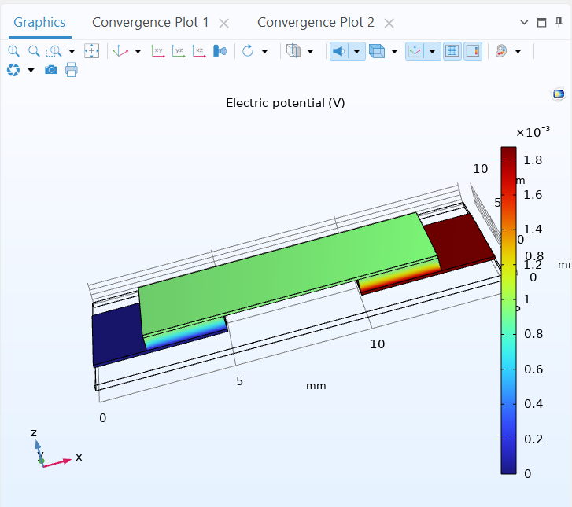
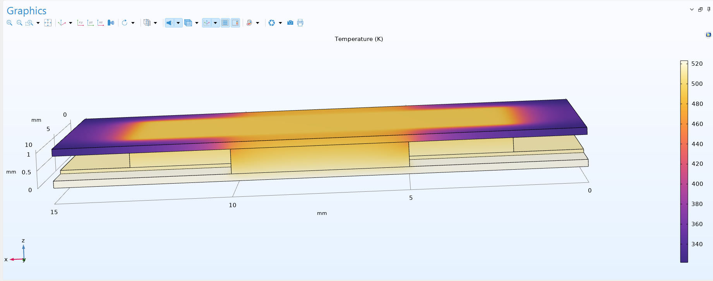
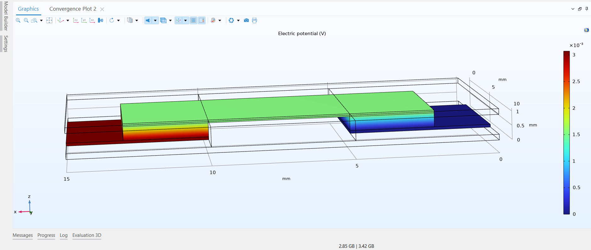
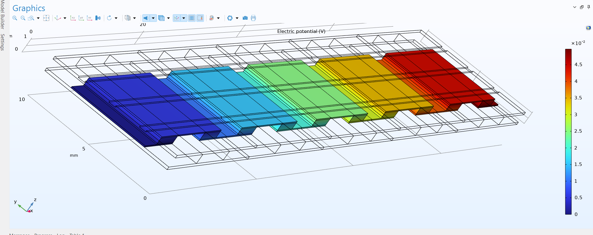
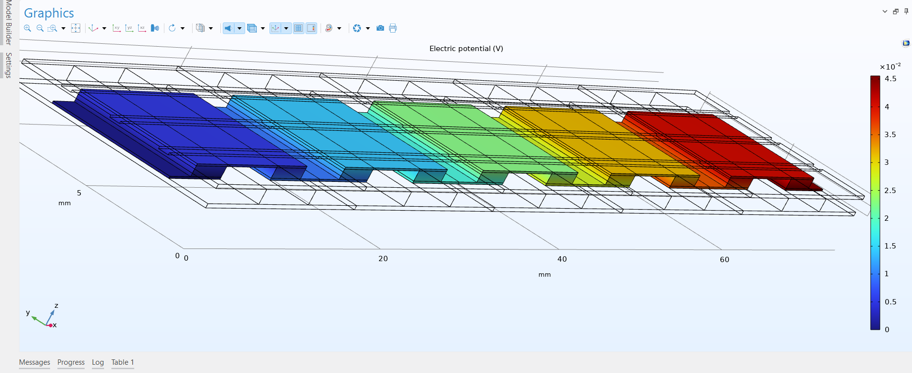
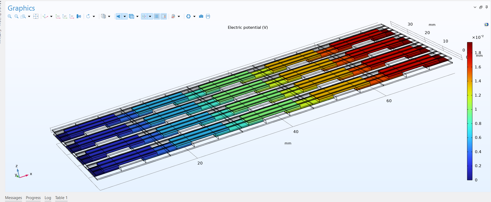
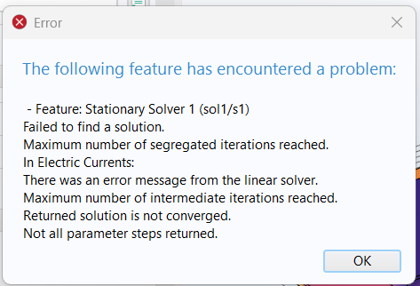

## English
# Auri-FlexTEG V4: Flexible Thermoelectric Generator Digital Twin

Welcome to the digital twin repository of the **Auri-FlexTEG V4** project. This repository contains the final COMSOL Multiphysics simulations, material parameters, and finite element analyses (FEA) of a thin-film, conformal thermoelectric generator (TEG). 

Designed specifically for wireless industrial IoT sensor nodes, this architecture aims to eliminate the need for battery replacements by harvesting continuous $250^\circ\text{C}$ waste heat from industrial pipes using a flexible, highly scalable matrix.

## 🔬 Micro-Architecture & Material Specifications

The V4 architecture utilizes a unique sandwich encapsulation method, engineered to optimize the $\Delta T$ (temperature gradient) across an ultra-thin $0.8\text{ mm}$ profile:

*   **Substrate Layer:** Polyimide (Kapton) base ($k = 0.12 \text{ W/(m·K)}$) integrated with highly thermally conductive 3M double-sided tape for conformal pipe adhesion.
*   **Thermoelectric Legs (The Ink):** 1D Silver Selenide ($Ag_2Se$) nanowires dispersed within a conductive PEDOT:PSS polymer matrix. 
    * *Effective Parameters:* $\sigma = 8810 \text{ S/m}$, $k = 0.4 \text{ W/mK}$, Seebeck Coefficient $S = \pm 120\ \mu\text{V/K}$.
*   **Electrical Routing:** Silver conductive ink operating as low-resistance interconnect bridges.
*   **Encapsulation & Radiative Cooling:** PDMS polymer doped with Barium Sulfate ($BaSO_4$) micro-particles ($\epsilon = 0.85$). The top surface features longitudinally cut micro-cavities (riblets) to disrupt the aerodynamic boundary layer and maximize convective heat transfer.

---

## 🧪 Simulation Phases & Iterative Testing

This digital twin is the result of rigorous iterative FEA testing. Below is the chronological progression of our architecture.

### Phase 1: The Thermal Bottleneck
Initial single-cell tests lacked advanced cooling mechanisms. The Kapton encapsulation acted as an extreme thermal blanket, causing the silver interconnects to trap heat. The lack of a sufficient $\Delta T$ resulted in poor electrical generation.

### Phase 2: Radiative Matrix & The Cavity Effect
To break the thermal bottleneck, we introduced the $BaSO_4$ radiative cooling layer and cut longitudinal riblets exactly above the silver bridges. This "Cavity Effect" allowed trapped heat to escape directly into the ambient environment via infrared radiation and increased localized turbulence.

### Phase 3: "Perfect Conditions" Array Scaling
We scaled the optimized unit cell into a 5x4 matrix, utilizing Kirchhoff's circuit laws (X-axis in series for voltage multiplication; Y-axis in parallel for internal resistance reduction). Under ideal laboratory conditions ($T_{amb} = 25^\circ\text{C}$, convective flux $h=15\text{ W/(m}^2\text{K)}$), the matrix produced a highly stable $\Delta T$ and yielded a peak potential of $45\text{ mV}$.

### Phase 4: Hostile Environment "Stress Test"
Industrial applications rarely offer ideal conditions. We stress-tested the 5x4 array in a simulated "hostile" environment: stagnant air ($h=5\text{ W/(m}^2\text{K)}$) and an elevated ambient temperature of $T_{amb} = 50^\circ\text{C}$. Despite extreme thermal compression, the radiative layer sustained the system, maintaining an internal resistance of $0.0195\ \Omega$ and generating $18\text{ mV}$.

*Calculated Power Output:* $P_{max} = V_{oc}^2 / (4 \cdot R_{int}) \approx 4.15\text{ mW}$

### Phase 5: Commercial Band Validation
A final expansion into a longer commercial patch format confirmed the scalability of the V4 design. The matrix efficiently maintained its potential across the extended surface, proving that voltage remains stable while global internal resistance drops linearly.

---

## ⚠️ Known Errors & FEA Troubleshooting
During the 3D array scaling process, we encountered severe mesh complexity issues. Executing boolean difference operations (the riblets) *after* the array generation stripped the boundary selections (Ground/Terminal nodes), causing the stationary solver to reach maximum segregated iterations and fail. Restructuring the geometry tree to complete all Boolean operations on the unit cell prior to array expansion resolved the non-converged solutions.

## 🏁 Conclusion
The V4 digital twin mathematically proves that an ultra-thin, flexible TEG patch can generate sufficient power (~4.15 mW per $30\text{ cm}^2$ segment) in stagnant, $50^\circ\text{C}$ environments. This safely exceeds the operational threshold for modern LoRaWAN/Zigbee nodes. Theoretical physics modeling is complete; the project now transitions to wet-lab chemical synthesis.
--------------------------------------------------------------------------------------

## Türkçe
# Auri-FlexTEG V4: Esnek Termoelektrik Jeneratör Dijital İkizi

**Auri-FlexTEG V4** projesinin açık kaynaklı dijital ikiz deposuna hoş geldiniz. Bu depo, endüstriyel kablosuz IoT sensör düğümleri için özel olarak tasarlanmış esnek, ince film termoelektrik jeneratörün (TEG) nihai COMSOL Multiphysics simülasyonlarını, termodinamik sınır koşullarını ve sonlu elemanlar analizlerini (FEA) içermektedir.

Temel vizyonumuz, boru hatlarındaki $250^\circ\text{C}$'lik atık ısıyı bükülebilir bir matris ile hasat ederek sensörlerin pil değiştirme maliyetlerini ve süreçlerini tamamen ortadan kaldırmaktır.

## 🔬 Mikro-Mimari ve Termofiziksel Parametreler

V4 mimarisi, ultra ince ($0.8\text{ mm}$) profil boyunca $\Delta T$ (sıcaklık gradyanını) maksimize etmek için özel bir sandviç kapsülleme yöntemi kullanır:

*   **Alt Taban (Substrat):** Boruya kusursuz mekanik temas ve ısı aktarımı için yüksek termal iletkenliğe sahip 3M çift taraflı bant destekli Poliimid (Kapton) zemin ($k = 0.12 \text{ W/(m·K)}$).
*   **Termoelektrik Bacaklar (Mürekkep):** İletken PEDOT:PSS polimer matrisi içine homojen olarak dağıtılmış 1 Boyutlu Gümüş Selenür ($Ag_2Se$) nanotelleri. 
    * *Efektif Değerler:* $\sigma = 8810 \text{ S/m}$, $k = 0.4 \text{ W/mK}$, Seebeck Katsayısı $S = \pm 120\ \mu\text{V/K}$.
*   **Elektrik Yolları:** Termoelektrik bacakları birbirine bağlayan düşük dirençli gümüş iletken mürekkep köprüleri.
*   **Kapsülleme ve Soğutma:** Işımalı soğutma (radiative cooling) yapabilmesi için Baryum Sülfat ($BaSO_4$) mikro-partikülleri ile katkılanmış PDMS polimeri ($\epsilon = 0.85$). Rüzgarın sınır tabakasını (boundary layer) yırtıp konvektif ısı transferini maksimize etmek için üst yüzeye boylamasına mikro-oluklar (riblet) işlenmiştir.

---

## 🧪 Simülasyon Aşamaları ve Test Geçmişi

Bu nihai dijital ikiz, ağır termal ve elektriksel stres testlerinin bir sonucudur. Aşağıda mimarimizin kronolojik gelişimi yer almaktadır.

### Aşama 1: Termal Darboğaz (Bottleneck)
İlk tek hücre (unit cell) testleri gelişmiş soğutma kalkanından yoksundu. Kapton kapsülleme yalıtkan bir termal battaniye görevi görerek ısının gümüş köprülerde hapsolmasına yol açtı. Yetersiz $\Delta T$ nedeniyle elektrik üretimi minimumda kaldı.

### Aşama 2: Işımalı Matris ve Kavite Etkisi
Termal darboğazı kırmak için $BaSO_4$ ışımalı soğutma katmanını uyguladık ve gümüş köprülerin tam üzerine gelecek şekilde üst kapağa boylamasına oluklar kestik. Bu "Kavite Etkisi", hapsolan ısının hem kızılötesi radyasyon yoluyla uzaya fırlatılmasını hem de lokal hava türbülansıyla soğumasını sağladı.

### Aşama 3: "Kusursuz Şartlar" Matris Çoğaltması
Optimize edilmiş hücreyi, Kirchhoff devre yasalarını (Voltaj katlaması için X-ekseni seri; İç direnci düşürmek için Y-ekseni paralel) kullanarak 5x4'lük bir matrise ölçeklendirdik. İdeal laboratuvar koşulları altında ($T_{amb} = 25^\circ\text{C}$, konvektif akı $h=15\text{ W/(m}^2\text{K)}$), sistem mükemmel bir şekilde soğudu ve $45\text{ mV}$ tepe potansiyeli üretti.

### Aşama 4: Düşman Ortam "Stres Testi"
Endüstriyel boru hatları asla ideal laboratuvar koşullarında bulunmaz. 5x4 matrisini simüle edilmiş bir "düşman" ortama soktuk: Durgun hava ($h=5\text{ W/(m}^2\text{K)}$) ve yüksek ortam sıcaklığı ($T_{amb} = 50^\circ\text{C}$). Olağanüstü termal baskıya rağmen, ışımalı soğutma kalkanı sistemi ayakta tuttu. İç direnç $0.0195\ \Omega$ seviyesinde kalarak sistem $18\text{ mV}$ potansiyel üretmeye devam etti.

*Hesaplanan Maksimum Güç:* $P_{max} = V_{oc}^2 / (4 \cdot R_{int}) \approx 4.15\text{ mW}$

### Aşama 5: Nihai Ticari Bant Doğrulaması
Matrisin ticari bir "yama" (patch) formatına doğru genişletilmesi, V4 tasarımının ölçeklenebilirliğini doğruladı. Genişletilmiş matris, düşman şartlar altındaki potansiyelini istikrarlı bir şekilde koruyarak, boyut büyüdükçe voltajın sabit kalıp iç direncin düştüğünü fiziksel olarak ispatladı.

---

## ⚠️ Karşılaşılan Hatalar ve FEA Çözümleri
3D dizi (array) oluşturma sürecinde ciddi "Mesh" (ağ oluşturma) hatalarıyla karşılaştık. Geometri ağacında (Model Builder) Boolean kesme işlemlerinin (olukların) *dizi çoğaltmasından sonra* yer alması, sistemin atanmış Topraklama (Ground) ve Terminal düğümlerini kaybetmesine yol açtı. Bu durum, Stationary Solver'ın maksimum iterasyona ulaşıp çökmesine sebep oldu. Geometri ağacı yeniden yapılandırılarak tüm kesme işlemlerinin tekli hücre (unit cell) üzerinde yapılması ve çoğaltmanın en sona bırakılmasıyla yakınsama (convergence) sorunu kalıcı olarak çözüldü.

## 🏁 Sonuç
V4 dijital ikizi, ultra ince ve esnek bir TEG yamasının, $50^\circ\text{C}$ ve durgun rüzgarsız bir hava gibi ekstrem durumlarda dahi yeterli gücü (~4.15 mW / $30\text{ cm}^2$) üretebileceğini matematiksel olarak kanıtlamıştır. Bu enerji, güncel LoRaWAN/Zigbee düğümlerini çalıştırmak için gereken eşiğin üzerindedir. Bilgisayar destekli teorik fizik modellemesi tamamlanmış olup, projemiz laboratuvar ortamında ıslak kimyasal sentez aşamasına geçiş yapmaktadır.
